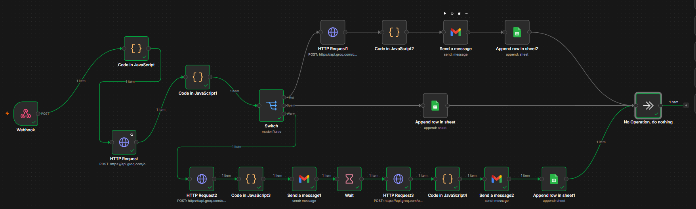

# AI Lead Qualification & Auto-Response Automation

An n8n-based automation that receives incoming leads via webhook, classifies them using Groq's LLM API, sends tailored email replies through Gmail, offers a Calendly booking link for scheduling calls, and logs every interaction to Google Sheets.


---

## Overview

This project automates the first stage of lead handling for AI/chatbot service inquiries — from the moment a lead submits a message to the point they're replied to, categorized, and (if qualified) invited to book a consultation.

1. A lead's message arrives through a **Webhook**.
2. The message is parsed and cleaned by **Code (JavaScript)** nodes.
3. An **HTTP Request** node sends the message to the **Groq API** (`llama-3.3-70b-versatile`) for classification.
4. A **Switch** node routes the lead into one of three buckets:
   - **🔥 Hot** – high-intent lead, ready to engage
   - **🌤️ Warm** – interested but needs a follow-up nudge
   - **🚫 Spam** – irrelevant/junk, logged only, no reply sent
5. Depending on the branch, the workflow:
   - Generates a personalized email reply via Groq
   - Sends it through **Gmail**
   - Includes a **Calendly** consultation link for Hot/Warm leads
   - Waits a set interval before a follow-up (Warm branch)
   - Appends lead + interaction data to the relevant **Google Sheet** tab

---

## Workflow Diagram



---

## Workflow Architecture

```
Webhook
  └─▶ Code in JavaScript ─▶ HTTP Request ─▶ Code in JavaScript1
                                                   │
                                                   ▼
                                                Switch (Hot / Warm / Spam)
                                                   │
        ┌──────────────────────────────┬──────────┴──────────┐
        ▼                              ▼                      ▼
   [Hot Branch]                  [Warm Branch]            [Spam Branch]
HTTP Request1                  HTTP Request2            Append row in sheet
Code in JavaScript2            Code in JavaScript3
Send a message                 Send a message1
Append row in sheet2           Wait
                                HTTP Request3
                                Code in JavaScript4
                                Send a message2
                                Append row in sheet1
        └──────────────────────────────┴──────────┬──────────┘
                                                    ▼
                                        No Operation, do nothing
```

---

## Nodes & Their Roles

| Node | Purpose |
|---|---|
| `Webhook` | Entry point — receives lead data via POST |
| `Code in JavaScript` / `1` / `2` / `3` / `4` | Parses/formats data between steps |
| `HTTP Request` (and numbered variants) | Calls Groq API for classification and reply generation |
| `Switch` | Routes lead to Hot / Warm / Spam path |
| `Wait` | Delays the Warm-branch follow-up send |
| `Send a message` (and numbered variants) | Sends the generated reply via Gmail |
| `Append row in sheet` (and numbered variants) | Logs lead + response data to Google Sheets |
| `No Operation, do nothing` | Terminal merge node — ends the flow |

---

## External Services Used

- **Groq API** — LLM completions (`llama-3.3-70b-versatile`) for lead classification and email copy generation
- **Gmail** — sending automated replies/follow-ups
- **Google Sheets** — logging leads by category (Hot / Warm / Spam)
- **Calendly** — booking link shared with qualified (Hot) leads for scheduling consultation calls

---


## Maintenance Notes

- If Groq updates its default response style, spot-check outgoing emails periodically to confirm no placeholder text creeps back in.
- The `Wait` node duration in the Warm branch controls the follow-up delay — adjust as needed based on desired lead nurture cadence.
- Consider adding basic error handling around the `Code in JavaScript` nodes that parse Groq's API response, in case of malformed or unexpected output.
